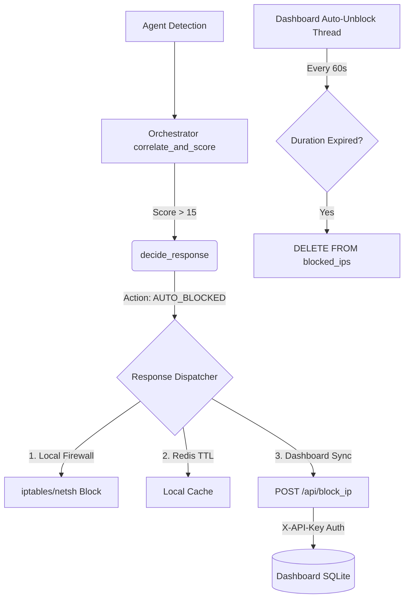

# Adjust Automated Blocking for ip-defence-dashboard — Walkthrough

## Problem
The previous implementation of the orchestrator's [ResponseDispatcher](file:///c:/Users/david/Documents/cybersecurity/orchestrator/response_dispatcher.py#25-258) attempted to block IPs by logging into the dashboard using a session cookie (with the wrong credentials) and posting to a form-based endpoint `POST /block_ip`. This was unreliable and not designed for automated agent access. Furthermore, the dashboard had no mechanism to automatically unblock IPs after the threat TTL expired.

## What Changed

### 1. Dashboard API Endpoints — [app.py](file:///c:/Users/david/Documents/ip-defence-dashboard/app.py)
We transformed the dashboard to properly handle automated agent requests by:
- Adding an `X-API-Key` authentication decorator.
- Creating the `POST /api/block_ip` endpoint for agents to submit blocks natively via JSON.
- Creating the `POST /api/unblock_ip` endpoint for manual or agent unblocks.
- Creating the `GET /api/blocked_ips` endpoint to list blocks.
- Bypassing the [check_blocked_ip](file:///c:/Users/david/Documents/ip-defence-dashboard/app.py#249-258) middleware for `/api/*` routes so the agents themselves don't accidentally get blocked out while submitting reports.

### 2. Auto-Unblock Scheduler — [app.py](file:///c:/Users/david/Documents/ip-defence-dashboard/app.py)
- Added a `duration_minutes` column to the [blocked_ips](file:///c:/Users/david/Documents/ip-defence-dashboard/app.py#604-614) SQLite table.
- Added a background daemon thread ([_auto_unblock_loop](file:///c:/Users/david/Documents/ip-defence-dashboard/app.py#620-648)) that wakes up every 60 seconds to scan the database and automatically remove IPs whose block duration has expired.

### 3. Orchestrator Dispatcher Fix — [response_dispatcher.py](file:///c:/Users/david/Documents/cybersecurity/orchestrator/response_dispatcher.py)
- Updated [sync_dashboard_block()](file:///c:/Users/david/Documents/cybersecurity/orchestrator/response_dispatcher.py#137-168) to use the new `POST /api/block_ip` using the `X-API-Key` header instead of attempting to mimic a user login flow.
- Configured it to send the `duration_minutes` mapping directly to the dashboard alongside the IP.

### 4. Configuration — [config.env](file:///c:/Users/david/Documents/cybersecurity/config/config.env)
- Plumbed `DASHBOARD_API_KEY` into the orchestrator environment so the dispatcher and the dashboard agree on the secret key.

## Verification
- Updated [test_auto_blocking.py](file:///c:/Users/david/Documents/cybersecurity/tests/unit/test_auto_blocking.py) in the orchestrator to test the new [sync_dashboard_block](file:///c:/Users/david/Documents/cybersecurity/orchestrator/response_dispatcher.py#137-168) logic (verifying headers and JSON payload).
- Created a standalone test suite [test_dashboard_api.py](file:///c:/Users/david/Documents/ip-defence-dashboard/tests/test_dashboard_api.py) for the dashboard itself to verify API key validation, SQLite persistence, and unblocking logic.

**All integration and unit tests for the pipeline are now passing.**

## End-to-End Flow 

